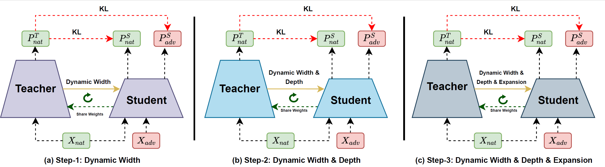

<h1 align="center">
  
  <br/>
    PROARD: PROGRESSIVE ADVERSARIAL ROBUSTNESS DISTILLATION: PROVIDE WIDE RANGE OF ROBUST STUDENTS
  </br>
</h1>
<p align="center">
<a href="#background">Background</a> •
<a href="#usage">Usage</a> •
<a href="#code">Code</a> •
<a href="#citation">Citation</a> •
</p>

## Background
Progressive Adversarial Robustness Distillation (ProARD), enabling the efficient
one-time training of a dynamic network that supports a diverse range of accurate and robust student
networks without requiring retraining. ProARD makes a dynamic deep neural network based on
dynamic layers by encompassing variations in width, depth, and expansion in each design stage to
support a wide range of architectures. 

<h1 align="center">
  
</h1>


## Usage
```
git clone https://github.com/hamidmousavi0/ProARD.git
```
## Code Structure
```
- attacks/ # Different Adversarial attack methods (PGD, AutoAttack, FGSM, DeepFool, etc. ([Refrence](https://github.com/imrahulr/hat.git)))
- proard/ 
    - classification/ 
        - data_provider/ # The dataset and dataloader definitions for Cifar-10, Cifar-100, and ImageNet.
        - elastic_nn/ 
            - modules/ # The deficnition of dynamic layers 
            - networks/ # The deficnition of dynamic networks 
            - training/ # Progressive training 
        -networks/ # The original networks
        -run_anager/ # The Configs and distributed training   
    - nas 
        - accuracy_predictor/ # The accuracy and robustness predictor
        - efficiency_predictor/ # The efficiency predictor
        - search_algorithm/ # The Multi-Objective Search Engine
    - utils/ # Utility functions
    - model_zoo.py # All the models for evaluation   
- create_acc_rob_pred_dataset.py # Create dataset to train the accuracy-robustness predictor.
- create_acc_rob_pred.py # make the predictor model.
- eval_ofa_net.py # Eval the sub-nets
- search_best.py # Search the best sub-net
- train_ofa_net_WPS.py # train the dynamic network without progressive training.
- train_ofa_net.py # Train the dynamic network with progressive training.
- train_teacher_net.py # Train teacher network for Robust knoweldge distillation. 

```
### Installing

**From Source**

Download this repository into your project folder.

### Details of the usage

## Evaluation

```
python eval_ofa_net.py --path path of dataset  --net Dynamic net name (ResNet50, MBV3) 
                       --dataset (cifar10, cifar100) --robust_mode (True, False)
                       --WPS (True, False) --attack ('fgsm', 'linf-pgd', 'fgm', 'l2-pgd', 'linf-df', 'l2-df', 'linf-apgd', 'l2-apgd','squar_attack','autoattack','apgd_ce')
```


## Training

### Step-0: Train Teacher Net

```
horovodrun -np 4 python train_teacher_net.py --model_name ("ResNet50", "MBV3") --dataset (cifar10, cifar100)
                                             --robust_mode (True, False) --epsilon 0.031 --num_steps 10
                                             --step_size 0.0078 --distance 'l-inf' --train_criterion 'trades'
                                             --attack_type 'linf-pgd'
```

### Step-1: Dynamic Width/Kernel training


```
horovodrun -np 4 python train_ofa_net.py --task 'width' or 'kernel' --model_name ("ResNet50", "MBV3") --dataset (cifar10, cifar100)
                                             --robust_mode (True, False) --epsilon 0.031 --num_steps 10
                                             --step_size 0.0078 --distance 'l-inf' --train_criterion 'trades'
                                             --attack_type 'linf-pgd' --kd_criterion 'rslad' --phase 1
```

### Step-2: Dynamic Width/Kernel and depth training

##### Phase-1
```
horovodrun -np 4 python train_ofa_net.py --task 'depth' --model_name ("ResNet50", "MBV3") --dataset (cifar10, cifar100)
                                             --robust_mode (True, False) --epsilon 0.031 --num_steps 10
                                             --step_size 0.0078 --distance 'l-inf' --train_criterion 'trades'
                                             --attack_type 'linf-pgd' --kd_criterion 'rslad' --phase 1
```
##### Phase-2
```
horovodrun -np 4 python train_ofa_net.py --task 'depth' --model_name ("ResNet50", "MBV3") --dataset (cifar10, cifar100)
                                             --robust_mode (True, False) --epsilon 0.031 --num_steps 10
                                             --step_size 0.0078 --distance 'l-inf' --train_criterion 'trades'
                                             --attack_type 'linf-pgd' --kd_criterion 'rslad' --phase 2
```

### Step-3: Dynamic Width/Kernel, depth, and expand training


##### Phase-1
```
horovodrun -np 4 python train_ofa_net.py --task 'expand' --model_name ("ResNet50", "MBV3") --dataset (cifar10, cifar100)
                                             --robust_mode (True, False) --epsilon 0.031 --num_steps 10
                                             --step_size 0.0078 --distance 'l-inf' --train_criterion 'trades'
                                             --attack_type 'linf-pgd' --kd_criterion 'rslad' --phase 1
```
##### Phase-2
```
horovodrun -np 4 python train_ofa_net.py --task 'expand' --model_name ("ResNet50", "MBV3") --dataset (cifar10, cifar100)
                                             --robust_mode (True, False) --epsilon 0.031 --num_steps 10
                                             --step_size 0.0078 --distance 'l-inf' --train_criterion 'trades'
                                             --attack_type 'linf-pgd' --kd_criterion 'rslad' --phase 2
```


<!--

* **ProAct** (the proposed algorithm) ([paper](https://arxiv.org/abs/2406.06313) and ([code](https://github.com/hamidmousavi0/reliable-relu-toolbox/tree/master/rrelu/search_bound/proact.py)).
* **FitAct** ([paper](https://arxiv.org/pdf/2112.13544) and [code](https://github.com/hamidmousavi0/reliable-relu-toolbox/tree/master/rrelu/search_bound/fitact.py)).
* **FtClipAct** ([paper](https://arxiv.org/pdf/1912.00941) and [code](https://github.com/hamidmousavi0/reliable-relu-toolbox/tree/master/rrelu/search_bound/ftclip.py)).
* **Ranger** ([paper](https://arxiv.org/pdf/2003.13874) and [code](https://github.com/hamidmousavi0/reliable-relu-toolbox/tree/master/rrelu/search_bound/ranger.py)).
-->


<!-- Use the following notebook to learn the main steps of the tool.
[](https://github.com/hamidmousavi0/reliable-relu-toolbox/blob/master/RReLU.ipynb)-->


## To-do list
- [ ] Add object detection Task
- [ ] Add Transformers architectures

<!--
### Run search in the command line 

When you download this repository into your project folder.
```
torchrun --nproc_per_node=2  search.py --dataset cifar10 --data_path "./dataset/cifar10"  --batch_size 128 --model "resnet20" --n_worker 32 \
                      --name_relu_bound "zero"  --name_serach_bound "ranger" --bounds_type "layer" --bitflip "fixed" --image_size 32 --pretrained_model
```
-->
## Citation

View the [published paper(preprint), Accepted in IJCNN 2025](https://www.arxiv.org/pdf/2506.07666).
<!--
```
@article{mousavi2024proact,
  title={ProAct: Progressive Training for Hybrid Clipped Activation Function to Enhance Resilience of DNNs},
  author={Mousavi, Seyedhamidreza and Ahmadilivani, Mohammad Hasan and Raik, Jaan and Jenihhin, Maksim and Daneshtalab, Masoud},
  journal={arXiv preprint arXiv:2406.06313},
  year={2024}
}
```
-->
## Acknowledgment

We acknowledge the National Academic Infrastructure for Supercomputing in Sweden (NAISS), partially funded by the Swedish Research Council through grant agreement no

## Contributors
Some of the code in this repository is based on the following amazing works:

[Once-For-All](https://github.com/mit-han-lab/once-for-all.git)
[Hat](https://github.com/imrahulr/hat.git)
